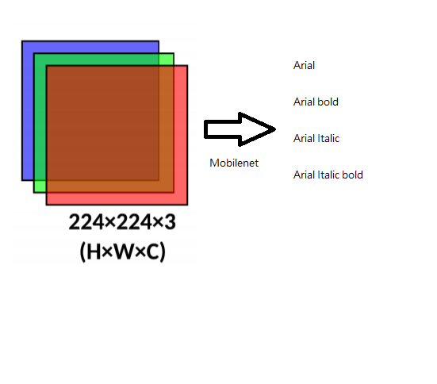

# Font classification

## Abstract 

Text information is very important for fraud detection because the ID license has its official text format requirement. Also, the continuous font type is the key feature for the Real ID license, so this project focuses on font classification on the document-based image with low computing resource requirements. I address the problem of fast font classification. I propose an efficient and lightweight network architecture. Also, due to the limited time and resources, I design the algorithm to produce the dataset for training and testing.

## Problem statement

Nowadays, fraud detection is a very popular issue in the deep learning world, because it is a valuable technique for large demand. For instance, the bank transaction needs to prove the id, or some test needs to verify the id first. To find the fraud in the Id, there are several ways to approach it. For example, the photo sticker's quality or the spatial information is correct or not in the ID, and the text information. This article focus on text information. In the text information, the font is the key issue that the id is a fraud or not. Currently, text detection is a mature topic which research by lots of people ( the article about text detection is up-to 340000) vs font classification( 30000). So I try to make the model that can 

## Related Work
First, using the synthetic dataset on training text task is a common approach, because training needs lots of data, and label this data needs lots of time. Therefore, inspired by SyntheText, this project uses synthetic data to train the network. However, the original project uses lots of natural images, which are too complex to training, so I only collected the driver licenses from each state. 

Second, according to "Character-independent font identification", the challenge of font classification is that the font is countless and the font difference is very small, for instance,

Therefore, they provide the idea that trains the model which can recognize the font different and base on subnet which learning a similar feature then vote for the prediction.

## Methodology 
### Dataset Generation
To simulate the background image which uses the license, I used the inpainting algorithm to remove the text in the background, then paint the text on it. Like the following picture:

### Architecture 
To run on the light resource demand environment, I decided to run on the light computing environment. After studying mobilenet, efficentnet, tinynet, I decided to use the mobilenet V3 to be the network architecture, because it seems it does the best in the classification task.

## Experiments
### the random image + random color char:
I found this is too difficult for the network to learning the feature map of the font. As the problem statement describes, the different font has little pixel difference, so the first model cannot train. So I decide to make the model recognize from the simple text to the complex condition
### the white background + black char (easiest):
I trained 1000 for four fonts for the model. The model shows the high accuracy on this simple task.
### the dark char + white background
I trained 10000 for four fonts with the dark char, which means each RGB channel's value under 50. At this point, the model performs well 
 

### the dark char + color background
Finally, I trained the 30000 for four fonts with dark char and color background.
 

## Results

Overall, the accuracy of ArialFamily is 96% on the test dataset. It seems the model conquer this problem. And the FPS is XX. Therefore, ArialFamily classification is finished.

## Examples 

predict: arial groundtruth: arial

predict: arialbd groundtruth:arialbd

predict: arialbi groundtruth:arialbi

predict: arialli groundtruth:arialli
## Reference:
## Reference:
Mobilenet V3 :https://github.com/kuan-wang/pytorch-mobilenet-v3  
Character-independent font identification : https://arxiv.org/pdf/2001.08893.pdf  
SynthText: https://github.com/ankush-me/SynthText
