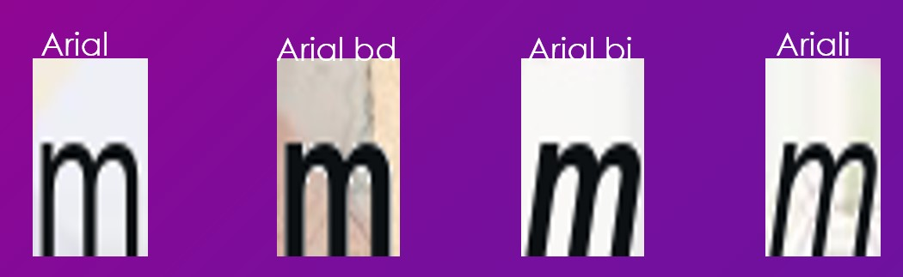
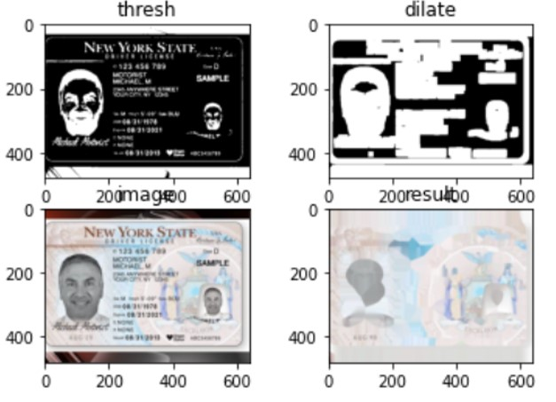

# Font classification

## Abstract 
This project try to finish the font classification task with the light computing resource.
## Problem statement

Nowadays, the fraud detection is very popular issue in deep learning world, because it is a value technique for large demand. For instance, the bank transaction needs to proof the id, or some test needs to verify the id first. In order to find the fraud in the Id, there are several way to approach.
Currently, the text detection is the very popular topic. However, there are seldom article talks about font classification. In the fraud detection, the font type continuous is the important feature to distinguish the fake id. Therefore, this article will focus on the font classification.

## Related Work
First, using the synthetic dataset on training text task is common approach, because training needs lots of data and label this data needs lots of time. Therefore, inspired by SyntheText, this project use the synthetic data to training network. 

Second, the challenge of font classification is that the font are countless, according to "Character-independent font identification" , they find that to distinguish the font 

## Methodology 

In order to run on the light resource demand environment, I decided to run on the light computing environment. After studying mobilenet, efficentnet, tinynet, I decided to use the mobilenet V3 to be the network architecture.
// todo need the mobilenet V3 model image

At first, the cla
## Experiments
1000=>2000=>30000
Training from easy background to complex background.

## Results

Overall, the accuracy of ArialFamily is 96% on test dataset. It seems the model conquer this problem. And the FPS is XX. Therefore, ArialFamily classification is finished.

## Examples 

