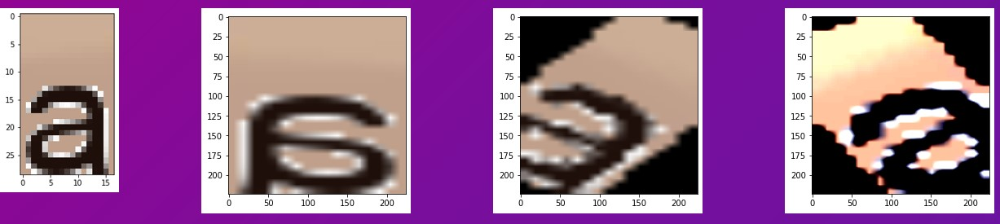

# Example Project

Write a 3-4 sentence abstract. It should introduce the problem and your approach. You may also want some numbers like 35 mAP and 78% accuracy. You can use this example README for your project, you can use a different ordering for your website, or you can make a totally different website altogether!

VIDEO GOES HERE (probably): Record a 2-3 minute long video presenting your work. One option - take all your figures/example images/charts that you made for your website and put them in a slide deck, then record the video over zoom or some other recording platform (screen record using Quicktime on Mac OS works well). The video doesn't have to be particularly well produced or anything.

## Introduction

Currently, the text detection is the very popular topic. However, there are seldom article talks about font classification. In the fraud detection, the font type continuous is the important feature to distinguish the fake id. Therefore, this article will focus on the font classification.

## Related Work

Nowadays, the font class is countless,

## Approach

In order to run on the light resource demand environment, I decided to run on the light computing environment. After studying mobilenet, efficentnet, tinynet, I decided to use the mobilenet V3 to be the network architecture.

At first, the cla

## Results

How did you evaluate your approach? How well did you do? What are you comparing to? Maybe you want ablation studies or comparisons of different methods.

You may want some qualitative results and quantitative results. Example images/text/whatever are good. Charts are also good. Maybe loss curves or AUC charts. Whatever makes sense for your evaluation.

## Discussion

You can talk about your results and the stuff you've learned here if you want. Or discuss other things. Really whatever you want, it's your project.
